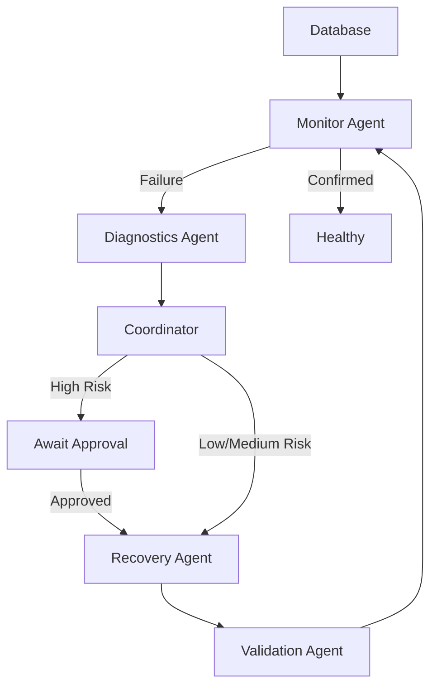

# AI-Powered Multi-Agent Database Reliability & Self-Healing Platform

## Problem Statement
Database downtime and manual incident recovery can lead to significant business losses and developer fatigue.

## Solution
This project implements a multi-agent self-healing workflow to monitor, diagnose, and recover from database failures automatically, while maintaining safety through strict validation and human-in-the-loop approvals for high-risk actions.

## Architecture


## Agent Responsibilities
| Agent | Role |
|---|---|
| Monitor | Continuously checks DB health, detects failures, alerts, and confirms health after recovery. |
| Diagnostics | Uses rules or LLM to explain failures and recommend approved recovery actions. |
| Coordinator | Manages system state, records communications, coordinates recovery/validation. |
| Recovery | Executes approved repairs (e.g., reconnect, create table). Records attempts. |
| Validation | Checks connectivity, schema, write/read operations after recovery. |

## Safety Features
- Allow-listed recovery tools
- Structured LLM output
- Independent validation
- Maximum retries
- Human approval for high-risk actions
- Escalation

## Installation

```bash
git clone https://github.com/yourusername/ai-database-recovery.git
cd ai-database-recovery
python -m venv .venv
```

Windows:
```bash
.venv\Scripts\activate
```
Mac/Linux:
```bash
source .venv/bin/activate
```

Install dependencies:
```bash
pip install -r requirements.txt
```

Environment:
```bash
copy .env.example .env
# Edit .env to add your OPENAI_API_KEY
```

Run FastAPI:
```bash
uvicorn app.main:app --reload
```

Run Streamlit Dashboard:
```bash
streamlit run dashboard/streamlit_app.py
```

## Testing
```bash
pytest
```\n